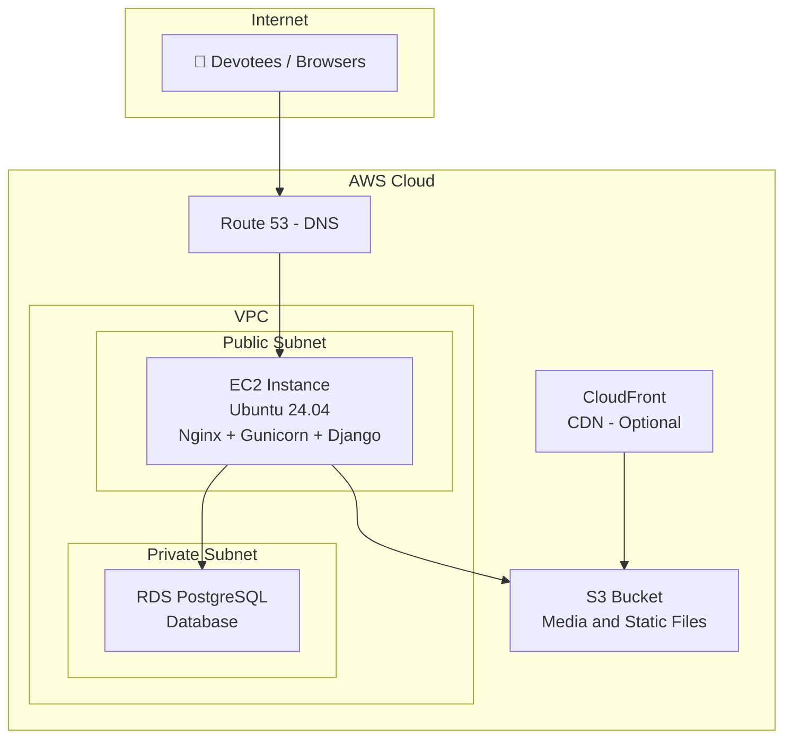

# 🚀 Hosting the Panchapeetas Django App on AWS — Complete Tutorial

> A step-by-step guide to deploying the **Veerashaiva Pancha Peethas** Django application on Amazon Web Services (AWS), migrating from PythonAnywhere/SQLite to a production-grade stack.

---

## Table of Contents

1. [AWS Basics for Beginners](#1-aws-basics-for-beginners)
2. [Terminal & SSH Basics](#2-terminal--ssh-basics)
3. [Architecture Overview](#3-architecture-overview)
4. [Prerequisites](#4-prerequisites)
5. [Step 1 — Launch an EC2 Instance](#5-step-1--launch-an-ec2-instance)
6. [Step 2 — Initial Server Setup](#6-step-2--initial-server-setup)
7. [Step 3 — Set Up PostgreSQL on RDS](#7-step-3--set-up-postgresql-on-rds)
8. [Step 4 — Configure S3 for Media & Static Files](#8-step-4--configure-s3-for-media--static-files)
9. [Step 5 — Deploy the Django Application](#9-step-5--deploy-the-django-application)
10. [Step 6 — Configure Gunicorn (WSGI Server)](#10-step-6--configure-gunicorn-wsgi-server)
11. [Step 7 — Configure Nginx (Reverse Proxy)](#11-step-7--configure-nginx-reverse-proxy)
12. [Step 8 — SSL Certificate with Let's Encrypt](#12-step-8--ssl-certificate-with-lets-encrypt)
13. [Step 9 — Production Settings Changes](#13-step-9--production-settings-changes)
14. [Step 10 — Domain Name Setup](#14-step-10--domain-name-setup)
15. [Step 11 — Monitoring & Maintenance](#15-step-11--monitoring--maintenance)
16. [Free Tier Cost Breakdown](#16-free-tier-cost-breakdown)
17. [Traffic Capacity & Limits](#17-traffic-capacity--limits)
18. [Live Streaming — How It Actually Works](#18-live-streaming--how-it-actually-works)
19. [Temporary Upgrade for Events](#19-temporary-upgrade-for-events)
20. [Troubleshooting](#20-troubleshooting)
21. [Quick Reference](#quick-reference)

---

## 1. AWS Basics for Beginners

Welcome! If you have never worked with Amazon Web Services (AWS) or web hosting before, don't worry. This guide is written specifically for you. Think of AWS as a giant company where you can rent computers, databases, and hard drives that live on the internet, instead of buying physical ones for your office.

### 1.1 Understanding Key AWS Concepts

Before clicking any buttons, here is a simple translation of the technical names you will see in this guide:

| Technical Term | Plain English Translation | What it does for Panchapeetas |
| :--- | :--- | :--- |
| **EC2 Instance** | A Virtual Computer in the Cloud | The main computer where the website code runs. It is kept on 24/7 so anyone can visit your site at any time. |
| **RDS PostgreSQL** | A Private Database Box | A secure database vault that only stores your website's structured data (devotee profiles, pooja bookings, peetha information). It is separate from the EC2 computer for safety and speed. |
| **S3 Bucket** | An Online Storage Folder | Like a Google Drive folder. This is where Swamiji photos, Peetha display images, and devotee profile pictures are stored securely. |
| **Elastic IP** | Permanent Phone Number | A permanent address for your virtual computer. Normally, when cloud computers reboot, their address changes. An Elastic IP ensures your website domain always knows exactly where to send visitors. |
| **Security Group** | Virtual Security Guard | A checklist of rules that decides who is allowed to connect to your servers. For example, it lets anyone visit the website, but only lets you manage the server. |

### 1.2 Creating an AWS Account & Security Alerts

To avoid unexpected fees and set up your account safely, follow these steps:

1. Go to [AWS Free Tier Sign Up](https://aws.amazon.com/free/) and click **Create a Free Account**.
2. Fill in your email, a strong password, and a contact name. You will need to enter a credit or debit card. *AWS charges a small temporary authorization fee (~$1 or ₹2) to verify your card, which is refunded immediately.*
3. Choose the **Basic Support — Free** plan when asked to choose a support plan.

> [!IMPORTANT]
> **Crucial: Set Up a Billing Alarm (Prevent Surprise Bills!)**
> AWS Free Tier is generous, but if you accidentally configure something wrong, you could get charged. Setting up an alarm ensures you get an email if your usage goes over $0.01.
>
> 1. Log in to your **AWS Console**.
> 2. In the top search bar, type **Billing** and select it.
> 3. On the left menu, click **Billing preferences**. Scroll down, check the boxes for **Receive PDF invoice by email** and **Receive Free Tier usage alerts**, and click **Save preferences**.
> 4. Now, type **Budgets** in the top search bar and click it.
> 5. Click the orange **Create budget** button.
> 6. Select the **Templates (simplified)** option, select the **Zero Spend Budget** template, enter your email address under **Email recipients**, and click **Create budget**.

---

## 2. Terminal & SSH Basics

To set up the server, you will need to type commands into a command line (often called the **Terminal**). This is like talking directly to the virtual computer without using a mouse.

### 2.1 What is SSH and how do I use my Key Pair?

When you create your EC2 instance, you will download a security key file ending in `.pem` (e.g., `panchapeethas-key.pem`). This key acts as your password. Because it is highly sensitive, your computer will refuse to connect if the key's permissions are too open.

#### Option A: Connecting on Windows (using Command Prompt / cmd)

If you are on Windows, you must configure the key file properties before using it:

1. Find your downloaded `.pem` file in Windows File Explorer (usually in your Downloads folder).
2. Right-click the file and select **Properties**.
3. Go to the **Security** tab and click **Advanced**.
4. Click **Disable inheritance**, then choose *"Remove all inherited permissions from this object"*.
5. Click **Add** → click **Select a principal** at the top.
6. In the box, type your Windows username (e.g., `Bhoja`), click **Check Names** to verify, and click **OK**.
7. Check the box for **Read** permissions under Basic permissions, and click **OK**.
8. Click **Apply**, then click **OK** on all open windows.

Now, open Command Prompt (search for `cmd` in the Start menu) and type:

```bash
# Move to the downloads folder where your key is saved
cd Downloads

# Connect to the server (replace 13.235.XX.XX with your Elastic IP)
ssh -i panchapeethas-key.pem ubuntu@13.235.XX.XX
```

#### Option B: Connecting on macOS / Linux

Open the **Terminal** app and type:

```bash
# Move to the downloads folder
cd ~/Downloads

# Lock the file permissions (makes it private/secure)
chmod 400 panchapeethas-key.pem

# Connect to the server (replace 13.235.XX.XX with your Elastic IP)
ssh -i panchapeethas-key.pem ubuntu@13.235.XX.XX
```

### 2.2 Beginner's Guide to the Nano Editor

During the setup, you will need to edit text files on the server (like setting database passwords). We use a simple terminal text editor called **Nano**. When you run a command like `sudo nano .env`, the terminal screen will turn into a text editor.

> **How to use Nano:**
> - **Moving around:** You *cannot* use your mouse. Use the **arrow keys** on your keyboard to move the text cursor.
> - **Typing:** Just start typing normally to add text.
> - **Saving your changes:** Press **Ctrl + O** (Write Out) on your keyboard. It will show the file name at the bottom. Press **Enter** to confirm saving.
> - **Exiting the editor:** Press **Ctrl + X**. If you forgot to save, it will ask at the bottom: *"Save modified buffer?"*. Press **Y** for Yes, then press **Enter** to exit.

---

## 3. Architecture Overview



| Component | AWS Service | Free Tier? | Purpose |
| :--- | :--- | :--- | :--- |
| Web Server | `EC2 (t3.micro or t2.micro)` | ✅ 750 hrs/month free | Runs Nginx + Gunicorn + Django |
| Database | `RDS PostgreSQL (db.t3.micro)` | ✅ 750 hrs/month free | Replaces SQLite for production |
| Media Storage | `S3` | ✅ 5 GB free | Stores peetha photos, swamiji images, profile pics |
| Static Files | `S3 + CloudFront` | ✅ 50 GB transfer free | CSS, JS, images served via CDN |
| DNS | `Route 53` | ❌ ~$0.50/month | Custom domain (optional — use external registrar for $0) |
| SSL | `Let's Encrypt` | ✅ Always free | HTTPS encryption |

---

## 4. Prerequisites

Before starting, ensure you have:
- An **AWS Account** ([Sign up here](https://aws.amazon.com/free/))
- A **domain name** (e.g., `panchapeethas.org`) — can be purchased via Route 53 or any registrar
- **AWS CLI** installed on your local machine
- A **key pair** (`.pem` file) for SSH access
- **Git** installed locally

> [!TIP]
> AWS Free Tier gives you 750 hours/month of `t3.micro` (or `t2.micro`) EC2 + 750 hours/month of `db.t3.micro` RDS + 5 GB S3 for the **first 12 months**. This is more than enough for the Panchapeetas platform. Your total cost in Year 1 will be **~$0/month** (or $0.50 if using Route 53 for DNS).

---

## 5. Step 1 — Launch an EC2 Instance

### 5.1 Choose the Instance (Virtual Server)

Follow these exact steps to create your free virtual server computer in the AWS Console:

1. Type **EC2** in the top AWS search bar and click the first option.
2. Click the orange **Launch instance** button on the right.
3. Under <strong>Name and tags</strong>, type <code>panchapeethas-webserver</code>.
4. Under <strong>Application and OS Images (Amazon Machine Image)</strong>, click the <strong>Ubuntu</strong> logo, then make sure the dropdown says <strong>Ubuntu Server 24.04 LTS (HVM), SSD Volume Type</strong> and shows the label *"Free Tier eligible"*.
5. Under <strong>Instance type</strong>, select <strong>t3.micro</strong> (or <strong>t2.micro</strong>) depending on which one is labeled *"Free tier eligible"* in your console. *(Note: We highly recommend t3.micro since it has 2 vCPUs and provides double the processing capability of t2.micro's 1 vCPU for the same free price.)*
6. Under <strong>Key pair (login)</strong>, click <strong>Create new key pair</strong>:
   - **Key pair name**: Type `panchapeethas-key`.
   - **Key pair type**: Select `RSA`.
   - **Private key file format**: Select `.pem`.
   - Click the orange **Create key pair** button. This will automatically download a file named `panchapeethas-key.pem` to your computer. **Keep this file safe; if you lose it, you will never be able to log into your server.**
7. Under <strong>Network settings</strong>, click <strong>Edit</strong> in the top right of that box:
   - Verify **Auto-assign public IP** is set to **Enable**.
   - For Firewall, select **Create security group** and name it `panchapeethas-sg`.
   - In the description, type `Panchapeethas Web Security Group`.
8. Under <strong>Configure storage</strong>, change the number from 8 GiB to **30 GiB**. *(AWS Free Tier allows up to 30 GB of storage for free; using more disk space is helpful so the database and logs don't run out of space.)*
9. Click the orange **Launch instance** button in the bottom right panel.

### 5.2 Configure Security Group

Now that you have created the EC2 instance, you need to configure its security rules (the firewall) to allow web traffic and remote login access. Here is how to configure it click-by-click:

1. Go to the left sidebar of the EC2 Dashboard, scroll down to **Network & Security**, and click on **Security Groups**.
2. Find the security group created for your instance (it should be named `panchapeethas-sg`, or look for the one associated with your instance if it was created under a default name like `launch-wizard-1`). Click on its **Security group ID** link.
3. In the bottom panel, click on the **Inbound rules** tab, then click the **Edit inbound rules** button on the right.
4. Click the **Add rule** button three times, and fill in the details for these three rules:

| Rule | Type (Dropdown) | Port Range | Source (Dropdown) | Purpose / Description |
| :--- | :--- | :--- | :--- | :--- |
| **Rule 1** | `SSH` | `22` | Select `My IP` (or `Anywhere-IPv4`) | Allows you to securely connect from your computer terminal |
| **Rule 2** | `HTTP` | `80` | Select `Anywhere-IPv4` (fills in `0.0.0.0/0`) | Allows devotees to view the website normally |
| **Rule 3** | `HTTPS` | `443` | Select `Anywhere-IPv4` (fills in `0.0.0.0/0`) | Allows secure, encrypted HTTPS checkout and visits |

5. Click the orange **Save rules** button in the bottom right corner of the page.

### 5.3 Allocate an Elastic IP (Permanent Address)

1. Go to the left sidebar of the EC2 Dashboard, scroll down to **Network & Security**, and click **Elastic IPs**.
2. Click the orange **Allocate Elastic IP address** button in the top right.
3. Click **Allocate** at the bottom.
4. Select the newly created IP address from the list, click the **Actions** button, and choose **Associate Elastic IP address**.
5. Choose **Instance** in the resource type, search for your `panchapeethas-webserver` instance in the dropdown box, and click **Associate**.

> [!IMPORTANT]
> Always use an Elastic IP for production. Without one, your server's public IP changes every time the instance restarts, breaking DNS records and SSL certificates.

```bash
# Note down your Elastic IP from the AWS dashboard, e.g.:
13.235.XX.XX
```

### 5.4 Connect to Your Instance

Use the steps in Section 2 to set up permissions and run the SSH command:

```bash
# SSH into the server (replace 13.235.XX.XX with your Elastic IP)
ssh -i panchapeethas-key.pem ubuntu@13.235.XX.XX
```

---

## 6. Step 2 — Initial Server Setup

Run these commands on the EC2 instance after SSH'ing in. These commands will configure your Linux server environment.

### 6.1 Update System Packages

Before installing software, update the list of available software on the server to prevent security issues.

> **What this command does:**
> - `sudo`: "Superuser Do" — runs the command as the system administrator.
> - `apt update`: Refreshes the local catalog of packages available for install.
> - `apt upgrade -y`: Installs updates for all currently installed programs (the `-y` auto-approves the command).

```bash
sudo apt update && sudo apt upgrade -y
```

### 6.2 Install Required System Packages

Install python utilities, database libraries, Nginx web server, and SSL tools needed by the Django app.

> **What this command does:**
> - `python3-pip` / `python3-venv`: Python package installer and virtual environment creator.
> - `nginx`: The web server that receives traffic from the internet.
> - `certbot` / `python3-certbot-nginx`: Automatic tools to secure your website with free SSL certificates.
> - `libjpeg-dev` / `zlib1g-dev`: Required for the Python Image Library (Pillow) to process image uploads.

```bash
sudo apt install -y \
    python3-pip \
    python3-venv \
    python3-dev \
    libpq-dev \
    postgresql-client \
    nginx \
    certbot \
    python3-certbot-nginx \
    git \
    supervisor \
    libjpeg-dev \
    zlib1g-dev \
    libfreetype6-dev
```

### 6.3 Create a Dedicated System User

Create a restricted user called `panchapeethas` to run the website. This prevents security bugs in the app from affecting the rest of the server.

> **What this command does:**
> - `adduser`: Adds a new user account.
> - `--system --group`: Creates a system account without a login screen (strictly for running programs).
> - `--home /opt/panchapeethas`: Creates a directory where our website code will reside.

```bash
sudo adduser --system --group --home /opt/panchapeethas panchapeethas
```

### 6.4 Set Up the Firewall

Turn on the built-in firewall on the server to block all ports except SSH (22) and Web traffic (80 and 443).

> **What this command does:**
> - `ufw allow OpenSSH`: Keeps your remote connection open so you don't get locked out.
> - `ufw allow 'Nginx Full'`: Opens ports 80 (HTTP) and 443 (HTTPS) to the public.
> - `ufw enable`: Turns on the firewall rules.

```bash
sudo ufw allow OpenSSH
sudo ufw allow 'Nginx Full'
sudo ufw enable
sudo ufw status
```

---

## 7. Step 3 — Set Up PostgreSQL on RDS

> [!WARNING]
> SQLite (currently used in local development) is **not suitable for production**. It doesn't support concurrent writes, which will cause crash errors when multiple devotees try to book poojas simultaneously. You must migrate to PostgreSQL on RDS.

### 7.1 Create an RDS Instance (Database Server)

PostgreSQL is a production-ready database engine. Managed databases are handled by AWS RDS. Here is how to create one click-by-click:

1. Type **RDS** in the top AWS search bar and select the first option.
2. Click the orange **Create database** button.
3. Under **Choose a database creation method**, select **Standard create**.
4. Under **Engine options**, click the **PostgreSQL** circle.
5. Under **Templates**, click the **Free Tier** circle. *(IMPORTANT: Do not skip this! Free Tier ensures you are not billed for this database during your first year.)*
6. Under **Settings**:
   - **DB instance identifier**: Type `panchapeethas-db`.
   - **Master username**: Type `panchapeethas_admin`.
   - **Credentials management**: Select **Self managed**.
   - **Master password**: Type a strong, long password. **Write this password down immediately in a safe note; you will need it in Step 9.**
7. Under **Connectivity**:
   - Select the default **Virtual Private Cloud (VPC)** (the same VPC your EC2 instance is in).
   - For **Public access**, click **No** (for security; only your website server should be allowed to speak to the database).
   - For **VPC security group**, select **Create new** and type the name `panchapeethas-db-sg`.
8. Scroll to the very bottom and click the orange **Create database** button. *It takes about 5 to 10 minutes for AWS to configure the database computer. Wait until its status shows as "Available" in the list.*

### 7.2 Configure DB Security Group

Configure the security rules to allow your EC2 instance to connect to your RDS Database:

1. In the RDS Database detail view under **Connectivity & security**, click the link under **VPC security groups** (which should be `panchapeethas-db-sg`).
2. In the Security Groups list, select it, scroll down, and click the **Inbound rules** tab. Click **Edit inbound rules**.
3. Click **Add rule**:
   - **Type**: Choose **PostgreSQL**.
   - **Port range**: Set to `5432`.
   - **Source**: Choose **Custom** and select `panchapeethas-sg` (your EC2 security group) from the search dropdown.
4. Click **Save rules**.

### 7.3 Test the Connection from EC2

Login to your database from the EC2 terminal command prompt to ensure access is working correctly, then create the production database:

> **What this command does:**
> - `psql`: Runs the PostgreSQL client tool.
> - `-h`: Connects to the host address of the RDS database.
> - `-U`: Logs in with your master username.
> - `CREATE DATABASE panchapeethas_db;`: Creates a blank database schema for our site.

```bash
# From your EC2 instance terminal (replace Host Endpoint URL with yours):
psql -h panchapeethas-db.xxxxxx.ap-south-1.rds.amazonaws.com \
     -U panchapeethas_admin \
     -d postgres

# Inside the PostgreSQL database client, type this command and press Enter:
CREATE DATABASE panchapeethas_db;

# Type this to exit:
\q
```

---

## 8. Step 4 — Configure S3 for Media & Static Files

Your app stores images in `media/peetha_media/` and `media/profile_pics/`. On AWS, these files must be stored in S3 for persistence.

### 8.1 Create an S3 Bucket (Storage Folder)

An S3 bucket is like an online hard drive for your website's files. Here is how to create it click-by-click:

1. Type **S3** in the top AWS search bar and click the first option.
2. Click the orange **Create bucket** button on the right.
3. Under **Bucket name**, type a unique name in all lowercase with hyphens, like `panchapeethas-media-files`. *Bucket names must be unique across all of AWS.*
4. Under **AWS Region**, choose **ap-south-1 (Asia Pacific / Mumbai)** for speed in India.
5. Scroll down to **Object Ownership** and select **ACLs enabled** (this is needed for Django to specify file permissions). Leave it set to **Bucket owner preferred**.
6. Scroll down to **Block Public Access settings for this bucket**. Uncheck the main box for **Block all public access**. *This is necessary so that devotees visiting your website can view Swamiji photos and images.*
7. Check the acknowledgement box below it: *"I acknowledge that the current settings might result in this bucket and the objects within it becoming public."*
8. Leave everything else at default and click the orange **Create bucket** button at the very bottom.

### 8.2 Create an IAM User for S3 Access

Create a secure access account for Django to save files to the S3 bucket:

1. Search **IAM** in the top search bar and click it.
2. Click **Users** on the left, then click the **Create user** button in the top right.
3. Name the user `panchapeethas-s3-user` and click **Next**.
4. Select **Attach policies directly**.
5. Click **Create policy**. A new tab will open.
6. Click the **JSON** tab and paste this policy content (replace `panchapeethas-media` with your actual bucket name):

```json
{
    "Version": "2012-10-17",
    "Statement": [
        {
            "Effect": "Allow",
            "Action": [
                "s3:PutObject",
                "s3:GetObject",
                "s3:DeleteObject",
                "s3:ListBucket"
            ],
            "Resource": [
                "arn:aws:s3:::panchapeethas-media",
                "arn:aws:s3:::panchapeethas-media/*"
            ]
        }
    ]
}
```
7. Click **Next: Tags**, click **Next: Review**. Give the policy a name like `PanchapeethasS3Policy` and click **Create policy**.
8. Go back to the other tab/window, search for `PanchapeethasS3Policy` in the filter list, check the box, and click **Next** and then **Create user**.
9. Click on the newly created user in the list, go to the **Security credentials** tab, and click **Create access key**.
10. Select **Application running outside AWS** and click **Next**, then click **Create access key**.
11. **Copy the Access Key ID and Secret Access Key immediately and save them somewhere secure. You will need them in Step 9.**

### 8.3 S3 Bucket Policy for Public Media Access

Set permissions so that uploaded media files are readable by public visitors:

1. Go back to the S3 bucket dashboard, click on your bucket name, and go to the **Permissions** tab.
2. Scroll down to **Bucket policy** and click **Edit**.
3. Paste this JSON (replace `panchapeethas-media` with your bucket name) and click **Save changes**:

```json
{
    "Version": "2012-10-17",
    "Statement": [
        {
            "Sid": "PublicReadMedia",
            "Effect": "Allow",
            "Principal": "*",
            "Action": "s3:GetObject",
            "Resource": "arn:aws:s3:::panchapeethas-media/media/*"
        }
    ]
}
```

### 8.4 Install Django S3 Storage Backend

Add these dependencies to your local `requirements.txt` file before pushing code to git:

```diff
 Django>=5.1.4,<5.2
 pillow>=12.0.0
 emoji>=2.15.0
 razorpay>=1.4.1
 whitenoise>=6.8.2
 django-allauth>=0.61.0
+gunicorn>=22.0.0
+psycopg2-binary>=2.9.9
+django-storages>=1.14.2
+boto3>=1.34.0
```

---

## 9. Step 5 — Deploy the Django Application

### 9.1 Clone the Repository

Switch to your dedicated user and clone your project code from GitHub onto the server:

> **What this command does:**
> - `sudo -u panchapeethas -s`: Logs into the shell command line as the restricted system user.
> - `cd /opt/panchapeethas`: Navigates to the directory where our code will live.
> - `git clone ...`: Copies your website project files from GitHub.

```bash
sudo -u panchapeethas -s
cd /opt/panchapeethas

# Clone your repo
git clone https://github.com/Gurucharan-G/panchapeeta.git app
cd app
```

### 9.2 Create a Virtual Environment

Set up an isolated python sandbox space for our packages to be installed safely:

> **What this command does:**
> - `python3 -m venv venv`: Creates a folder named 'venv' containing an isolated copy of Python.
> - `source venv/bin/activate`: Tells the command prompt to use this isolated copy of Python.
> - `pip install -r requirements.txt`: Installs all listed python libraries inside the sandbox folder.

```bash
python3 -m venv venv
source venv/bin/activate

# Install dependencies
pip install --upgrade pip
pip install -r requirements.txt
```

### 9.3 Create the Environment File

Create a hidden configuration settings file to store database credentials and secret keys securely:

> **What this command does:**
> - `sudo nano /opt/panchapeethas/app/.env`: Opens the Nano text editor to create a file named `.env`.

```bash
sudo nano /opt/panchapeethas/app/.env
```

Paste the following contents into the Nano text editor. Replace keys, database endpoint addresses, and passwords with your actual details. Make sure there are no spaces around the `=` signs:

```ini
# ===== DJANGO CORE =====
DJANGO_SECRET_KEY=your-very-long-random-secret-key-here
PRODUCTION=True
DJANGO_ALLOWED_HOSTS=panchapeethas.org,www.panchapeethas.org,13.235.XX.XX

# ===== DATABASE (RDS PostgreSQL) =====
DB_ENGINE=django.db.backends.postgresql
DB_NAME=panchapeethas_db
DB_USER=panchapeethas_admin
DB_PASSWORD=your-rds-password-here
DB_HOST=panchapeethas-db.xxxxxx.ap-south-1.rds.amazonaws.com
DB_PORT=5432

# ===== AWS S3 =====
AWS_ACCESS_KEY_ID=AKIA...your-key
AWS_SECRET_ACCESS_KEY=your-secret-key
AWS_STORAGE_BUCKET_NAME=panchapeethas-media
AWS_S3_REGION_NAME=ap-south-1

# ===== GOOGLE OAUTH =====
GOOGLE_CLIENT_ID=your-google-client-id
GOOGLE_CLIENT_SECRET=your-google-client-secret
```
*(Remember: In Nano, save by pressing **Ctrl + O**, then press **Enter**. Exit by pressing **Ctrl + X**.)*

> [!CAUTION]
> Never commit the `.env` file to Git/GitHub. Add it to `.gitignore` immediately. If committed, anyone on the internet can see your database password.

### 9.4 Generate a Secure Secret Key

Run this script command to output a secure random code to paste into your `.env` file:

```bash
python3 -c "from django.core.management.utils import get_random_secret_key; print(get_random_secret_key())"
```

---

## 10. Step 6 — Configure Gunicorn (WSGI Server)

Gunicorn runs the Python application server in the background. It takes requests from Nginx and passes them to Django.

### 10.1 Test Gunicorn

Make sure Gunicorn can start and run the application without errors:

```bash
cd /opt/panchapeethas/app
source venv/bin/activate

gunicorn --bind 0.0.0.0:8000 config.wsgi:application
# Visit http://13.235.XX.XX:8000 on your browser to verify (then press Ctrl+C in terminal to stop it)
```

### 10.2 Create a Systemd Service

Create a service config so that Ubuntu keeps Gunicorn running at all times automatically, even after server reboots:

```bash
sudo nano /etc/systemd/system/panchapeethas.service
```

Paste the configuration details below into the file:

```ini
[Unit]
Description=Panchapeethas Django Application (Gunicorn)
After=network.target

[Service]
User=panchapeethas
Group=panchapeethas
WorkingDirectory=/opt/panchapeethas/app
EnvironmentFile=/opt/panchapeethas/app/.env
ExecStart=/opt/panchapeethas/app/venv/bin/gunicorn \
    --workers 2 \
    --bind unix:/opt/panchapeethas/app/panchapeethas.sock \
    --timeout 120 \
    --access-logfile /var/log/panchapeethas/access.log \
    --error-logfile /var/log/panchapeethas/error.log \
    config.wsgi:application
Restart=always
RestartSec=3

[Install]
WantedBy=multi-user.target
```

### 10.3 Create Log Directory & Enable Service

Configure folder permissions and start the system service:

> **What this command does:**
> - `mkdir -p`: Creates a folder path to store log outputs.
> - `chown`: Sets the owner of the folder to our restricted user.
> - `systemctl daemon-reload`: Tells Ubuntu to scan for new services.
> - `systemctl start / enable`: Starts the service now and configures it to run automatically on system boot.

```bash
sudo mkdir -p /var/log/panchapeethas
sudo chown panchapeethas:panchapeethas /var/log/panchapeethas

sudo systemctl daemon-reload
sudo systemctl start panchapeethas
sudo systemctl enable panchapeethas

# Verify that it is running successfully (should say 'active (running)')
sudo systemctl status panchapeethas
```

> [!TIP]
> **Why 2 workers?** The `t2.micro` server has 1 vCPU and 1 GB RAM. The formula is `(2 × CPU cores) + 1 = 3`, but we use 2 workers to save RAM. If you upgrade to `t3.small` (2 vCPU, 2 GB RAM) for a festival, increase this to 4 workers.

---

## 11. Step 7 — Configure Nginx (Reverse Proxy)

Nginx sits in front of Gunicorn. It manages SSL security certificates, handles static assets (CSS/JS), and acts as the gatekeeper.

### 11.1 Create the Nginx Site Config

Open a new Nginx website configuration file:

```bash
sudo nano /etc/nginx/sites-available/panchapeethas
```

Paste the following Nginx server config block. Replace domain names and server IP address with your details:

```nginx
server {
    listen 80;
    server_name panchapeethas.org www.panchapeethas.org 13.235.XX.XX;

    # Max upload size (for swamiji photos, media uploads)
    client_max_body_size 20M;

    # Static files (handled by Django but cached by Nginx)
    location /static/ {
        alias /opt/panchapeethas/app/staticfiles/;
        expires 30d;
        add_header Cache-Control "public, immutable";
    }

    # Media files (temporary fallbacks if S3 is down)
    location /media/ {
        alias /opt/panchapeethas/app/media/;
        expires 7d;
    }

    # Pass all other traffic to the Gunicorn background socket
    location / {
        proxy_pass http://unix:/opt/panchapeethas/app/panchapeethas.sock;
        proxy_set_header Host $host;
        proxy_set_header X-Real-IP $remote_addr;
        proxy_set_header X-Forwarded-For $proxy_add_x_forwarded_for;
        proxy_set_header X-Forwarded-Proto $scheme;
    }
}
```

### 11.2 Enable the Site

Activate Nginx config by creating a symbolic link shortcut to it in Nginx's enabled sites folder:

> **What this command does:**
> - `ln -s`: Creates a pointer link between sites-available and sites-enabled folders.
> - `rm ... default`: Deletes Nginx's default test page configuration.
> - `nginx -t`: Verifies there are no spelling errors in Nginx files.

```bash
sudo ln -s /etc/nginx/sites-available/panchapeethas /etc/nginx/sites-enabled/
sudo rm -f /etc/nginx/sites-enabled/default

# Test configuration (must return syntax is ok)
sudo nginx -t

# Restart Nginx server to apply changes
sudo systemctl restart nginx
```

---

## 12. Step 8 — SSL Certificate with Let's Encrypt

SSL adds a padlock next to your domain, enabling HTTPS security. Without it, credit card processors like Razorpay will block payments.

### 12.1 Obtain the Certificate

Run Certbot to request a secure key certificate. It will modify your Nginx config to automatically redirect HTTP traffic to secure HTTPS:

```bash
sudo certbot --nginx -d panchapeethas.org -d www.panchapeethas.org
```
*(Follow prompts: Enter your email, type 'Y' to accept terms, and choose 'Yes' when asked to redirect all HTTP traffic to HTTPS.)*

### 12.2 Verify Auto-Renewal

Certificates expire after 90 days. Run a test dry-run to ensure the automated renewal program works:

```bash
sudo certbot renew --dry-run
```

---

## 13. Step 9 — Production Settings Changes

Configure Django settings inside `config/settings.py` to load database passwords and keys from the private `.env` file instead of hardcoded values.

### 13.1 Update `config/settings.py`

Make sure these variables are set dynamically using environment variables:

```python
import os
from pathlib import Path

BASE_DIR = Path(__file__).resolve().parent.parent

# ===== SECURITY settings =====
SECRET_KEY = os.environ.get('DJANGO_SECRET_KEY')
DEBUG = not os.environ.get('PRODUCTION', 'False') == 'True'

ALLOWED_HOSTS = os.environ.get(
    'DJANGO_ALLOWED_HOSTS',
    'localhost,127.0.0.1'
).split(',')

# ===== DATABASE setup =====
if os.environ.get('DB_ENGINE'):
    DATABASES = {
        'default': {
            'ENGINE': os.environ.get('DB_ENGINE'),
            'NAME': os.environ.get('DB_NAME'),
            'USER': os.environ.get('DB_USER'),
            'PASSWORD': os.environ.get('DB_PASSWORD'),
            'HOST': os.environ.get('DB_HOST'),
            'PORT': os.environ.get('DB_PORT'),
        }
    }
else:
    DATABASES = {
        'default': {
            'ENGINE': 'django.db.backends.sqlite3',
            'NAME': BASE_DIR / 'db.sqlite3',
        }
    }

# ===== AWS S3 MEDIA STORAGE (production only) =====
if not DEBUG:
    STATICFILES_STORAGE = "whitenoise.storage.CompressedManifestStaticFilesStorage"

    DEFAULT_FILE_STORAGE = 'storages.backends.s3boto3.S3Boto3Storage'
    AWS_ACCESS_KEY_ID = os.environ.get('AWS_ACCESS_KEY_ID')
    AWS_SECRET_ACCESS_KEY = os.environ.get('AWS_SECRET_ACCESS_KEY')
    AWS_STORAGE_BUCKET_NAME = os.environ.get('AWS_STORAGE_BUCKET_NAME')
    AWS_S3_REGION_NAME = os.environ.get('AWS_S3_REGION_NAME', 'ap-south-1')
    AWS_S3_CUSTOM_DOMAIN = f'{AWS_STORAGE_BUCKET_NAME}.s3.amazonaws.com'
    AWS_DEFAULT_ACL = None
    AWS_S3_OBJECT_PARAMETERS = {
        'CacheControl': 'max-age=86400',
    }
    MEDIA_URL = f'https://{AWS_S3_CUSTOM_DOMAIN}/media/'

# ===== HTTPS SECURITY HEADERS =====
if not DEBUG:
    SECURE_SSL_REDIRECT = True
    SESSION_COOKIE_SECURE = True
    CSRF_COOKIE_SECURE = True
    SECURE_HSTS_SECONDS = 31536000
    SECURE_HSTS_INCLUDE_SUBDOMAINS = True
    SECURE_HSTS_PRELOAD = True
    SECURE_PROXY_SSL_HEADER = ('HTTP_X_FORWARDED_PROTO', 'https')
    CSRF_TRUSTED_ORIGINS = [
        'https://panchapeethas.org',
        'https://www.panchapeethas.org',
    ]
```

### 13.2 Run Migrations & Collect Static

Run these django configuration commands inside the active virtual environment on EC2:

> **What this command does:**
> - `export $(...)`: Loads your credentials inside the `.env` file into command line memory.
> - `python manage.py migrate`: Instructs Django to generate database tables in your secure PostgreSQL database.
> - `collectstatic`: Moves CSS stylesheet, layout scripts, and logos into a folder Nginx can access.
> - `createsuperuser`: Prompts you to set up an admin login username and password.

```bash
cd /opt/panchapeethas/app
source venv/bin/activate

# Load settings settings variables
export $(grep -v '^#' .env | xargs)

# Run migrations
python manage.py migrate

# Collect static files
python manage.py collectstatic --noinput

# Create a superuser for the admin panel
python manage.py createsuperuser
```

### 13.3 Migrate Existing Data from SQLite

To move existing data from SQLite database to the RDS database PostgreSQL server:

```bash
# Step 1: Export data from local machine
python manage.py dumpdata --exclude contenttypes --exclude auth.permission \
    --indent 2 > datadump.json

# Step 2: Copy datadump to EC2
scp -i panchapeethas-key.pem datadump.json ubuntu@13.235.XX.XX:/opt/panchapeethas/app/

# Step 3: Load into PostgreSQL on EC2
python manage.py loaddata datadump.json
```

---

## 14. Step 10 — Domain Name Setup

### 14.1 If using AWS Route 53

1. Search **Route 53** in the top console search bar.
2. Click **Hosted zones** and select your domain name.
3. Click **Create record**:
   - **Record name**: Leave blank (for `panchapeethas.org`).
   - **Record type**: Select `A — Routes traffic to an IPv4 address`.
   - **Value**: Paste your Elastic IP address.
   - Click **Create records**.
4. Click **Create record** again:
   - **Record name**: Type `www`.
   - **Record type**: Select `A`.
   - **Value**: Paste your Elastic IP address.
   - Click **Create records**.

### 14.2 If Domain is with another registrar (GoDaddy, Namecheap, Hostinger, etc.)

Log into your provider's control panel (GoDaddy, etc.), open your domain's DNS Settings page, and add an **A record** pointing to your Elastic IP:

| Type | Host/Name | Value/IP | TTL |
| :--- | :--- | :--- | :--- |
| A | `@` (or blank) | `13.235.XX.XX` (Your Elastic IP) | Default / 3600 |
| A | `www` | `13.235.XX.XX` (Your Elastic IP) | Default / 3600 |

---

## 15. Step 11 — Monitoring & Maintenance

### 15.1 Automation: Deployment Script

Save this script on the server. Whenever you update code, you will only need to run this single file to apply updates:

```bash
#!/bin/bash
# Save this file inside /opt/panchapeethas/app/deploy.sh

cd /opt/panchapeethas/app
source venv/bin/activate
export $(grep -v '^#' .env | xargs)

# Pull latest code from Github
git pull origin main

# Install packages & apply updates
pip install -r requirements.txt
python manage.py migrate --noinput
python manage.py collectstatic --noinput

# Restart system services to pick up code changes
sudo systemctl restart panchapeethas
sudo systemctl restart nginx

echo "✅ Website Deployment update complete!"
```

```bash
# Make the script runnable
chmod +x /opt/panchapeethas/app/deploy.sh

# To run it in the future, simply run:
./deploy.sh
```

### 15.2 View Server Logs

If the site returns errors, use these commands to inspect what went wrong in the background:

```bash
# View Gunicorn python application logs
sudo tail -f /var/log/panchapeethas/error.log

# View Nginx access traffic logs
sudo tail -f /var/log/nginx/access.log
```

---

## 16. Free Tier Cost Breakdown

### Year 1 (Free Tier Active)

| Service | Instance | Free Tier Allowance | Monthly Cost |
| :--- | :--- | :--- | :--- |
| EC2 | `t3.micro` or `t2.micro` (1-2 vCPU, 1 GB) | 750 hrs/month | **$0** |
| RDS PostgreSQL | `db.t3.micro` | 750 hrs/month | **$0** |
| S3 | 5 GB storage | 5 GB + 20K GETs | **$0** |
| EBS Storage | 30 GB gp3 | 30 GB free | **$0** |
| Elastic IP | Associated with running instance | Free when attached | **$0** |
| Data Transfer | Outbound | 100 GB/month | **$0** |
| SSL (Let's Encrypt) | Certificate | Always free | **$0** |
| Route 53 (optional) | Hosted zone | Not included in Free Tier | ~$0.50 |
| **Total (Year 1)** | | *or $0.50 with Route 53* | **$0/month** |

> [!TIP]
> **Skip Route 53 entirely** to make hosting truly $0/month. Just point your domain's A record directly to the Elastic IP address from your existing domain registrar panel (GoDaddy, Namecheap, etc.) at no extra cost.

### After Year 1 (Free Tier Expired)

| Service | Instance | Monthly Cost (ap-south-1) |
| :--- | :--- | :--- |
| EC2 | `t3.micro` or `t2.micro` | ~$8.50/month |
| RDS PostgreSQL | `db.t3.micro` | ~$13/month |
| S3 | 5 GB storage + transfers | ~$1/month |
| Elastic IP | Associated with running instance | $0 |
| **Total (After Year 1)** | | **~$22.50/month** |

---

## 17. Traffic Capacity & Limits

### `t3.micro` (and `t2.micro`) Specifications

| Resource | Value |
| :--- | :--- |
| vCPU | 2 (for t3.micro) or 1 (for t2.micro) |
| RAM | 1 GB |
| Baseline CPU | 10% |
| Burst CPU | 100% (using credits) |
| CPU credits earned/hour | 6 |
| Max stored credits | 144 |

### How Much Traffic Can It Handle?

| Metric | `t3.micro / t2.micro` Capacity |
| :--- | :--- |
| **Concurrent users** | ~20–50 at the same time (t3.micro handles spikes better) |
| **Requests per second** | ~10–30 req/s |
| **Daily unique visitors** | ~2,000–5,000 |
| **Monthly visitors** | ~50,000–100,000 |
| **Daily page views** | ~10,000–25,000 |
| **Pooja bookings per day** | ~500 |

---

## 18. Live Streaming — How It Actually Works

Your app uses **embedded YouTube live streams** (via the `live_youtube_url` field on each Peetha). This is critical to understand for capacity planning:

### Architecture: YouTube Does the Heavy Lifting


| Action | Hits Your EC2? | Load on Your Server |
| :--- | :--- | :--- |
| Opening the peetha page | ✅ Yes | **1 request per user** |
| Watching YouTube live stream for hours | ❌ No | **Zero** — YouTube handles it |
| Refreshing the page | ✅ Yes | 1 request |
| Booking a pooja while watching | ✅ Yes | 2–3 requests |
| YouTube chat/comments | ❌ No | YouTube handles it |

### Real Scenario: 3000 Users × 10 Hours × 10 Days

| Metric | Value |
| :--- | :--- |
| **Peak EC2 load** | ~3000 page loads when users first open the page |
| **Sustained EC2 load while watching** | **Nearly zero** |
| **YouTube cost to you** | **$0** — YouTube hosts everything for free |
| **EC2 data transfer** | ~3000 × 500 KB = **~1.5 GB** one-time |
| **S3 data transfer** | Images on the page = ~3 GB total |
| **Your total cost** | **$0** (Free Tier) |

---

## 19. Temporary Upgrade for Events

For high-traffic events (festivals, special live streams), you can upgrade your EC2 instance temporarily and downgrade after. It takes ~2 minutes and costs very little.

### How to Upgrade (3 Steps)

```
Step 1: Stop the instance
   AWS Console → EC2 → Select instance → Instance State → Stop

Step 2: Change instance type
   Actions → Instance Settings → Change Instance Type → t3.small → Apply

Step 3: Start the instance
   Instance State → Start
```

### How to Downgrade After the Event

Same 3 steps — just change `t3.small` back to `t3.micro` (or `t2.micro`).

> [!NOTE]
> Your **Elastic IP stays attached** through stop/start, so your domain URL doesn't change. All data, configuration, and deployments remain intact. Nothing needs to be re-configured.

---

## 20. Troubleshooting

### Common Issues

| Problem | Cause | Solution |
| :--- | :--- | :--- |
| **502 Bad Gateway** | Gunicorn not running or socket mismatch | `sudo systemctl status panchapeethas` → check logs |
| **Static files missing** | `collectstatic` not run | `python manage.py collectstatic --noinput` |
| **Media uploads fail** | S3 permissions or bucket policy | Check IAM policy and bucket CORS settings |
| **Database connection refused** | Security group misconfigured | Ensure EC2 SG is allowed in RDS SG on port 5432 |
| **CSRF verification failed** | Missing `CSRF_TRUSTED_ORIGINS` | Add your domain to `CSRF_TRUSTED_ORIGINS` in settings |
| **Google OAuth redirect error** | Wrong callback URL in Google Console | Update to `https://panchapeethas.org/accounts/google/login/callback/` |
| **Razorpay webhook failures** | Server not reachable on HTTPS | Verify SSL is working and port 443 is open |

### Useful Debug Commands

```bash
# Check if Gunicorn is running
sudo systemctl status panchapeethas

# Check Nginx config syntax
sudo nginx -t

# Check open ports
sudo ss -tlnp

# Test database connection
python manage.py dbshell

# Run Django checks
python manage.py check --deploy
```

---

## Quick Reference

### Full First-Time Setup Setup

```bash
# 1. SSH into EC2
ssh -i panchapeethas-key.pem ubuntu@13.235.XX.XX

# 2. Install packages
sudo apt update && sudo apt upgrade -y
sudo apt install -y python3-pip python3-venv python3-dev libpq-dev \
    postgresql-client nginx certbot python3-certbot-nginx git \
    libjpeg-dev zlib1g-dev libfreetype6-dev

# 3. Clone & set up user
sudo adduser --system --group --home /opt/panchapeethas panchapeethas
sudo -u panchapeethas git clone https://github.com/Gurucharan-G/panchapeeta.git /opt/panchapeethas/app
cd /opt/panchapeethas/app
sudo -u panchapeethas python3 -m venv venv
sudo -u panchapeethas venv/bin/pip install -r requirements.txt

# 4. Configure .env, systemd service, nginx (as shown in Step 9, 10, 11)

# 5. Deploy database & statics
python manage.py migrate
python manage.py collectstatic --noinput
python manage.py createsuperuser
sudo systemctl start panchapeethas
sudo systemctl start nginx

# 6. Secure with SSL
sudo certbot --nginx -d panchapeethas.org -d www.panchapeethas.org
```

### Subsequent Deployments

```bash
/opt/panchapeethas/app/deploy.sh
```
