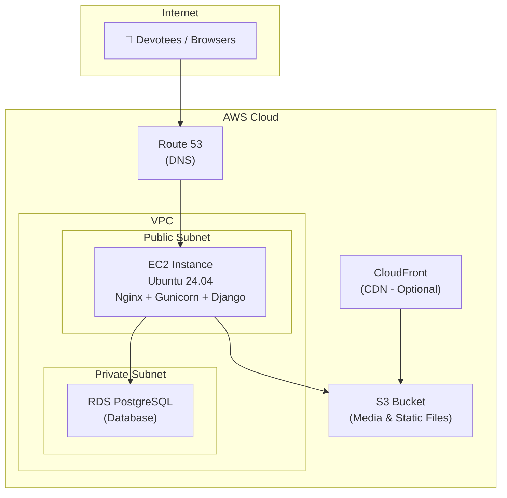
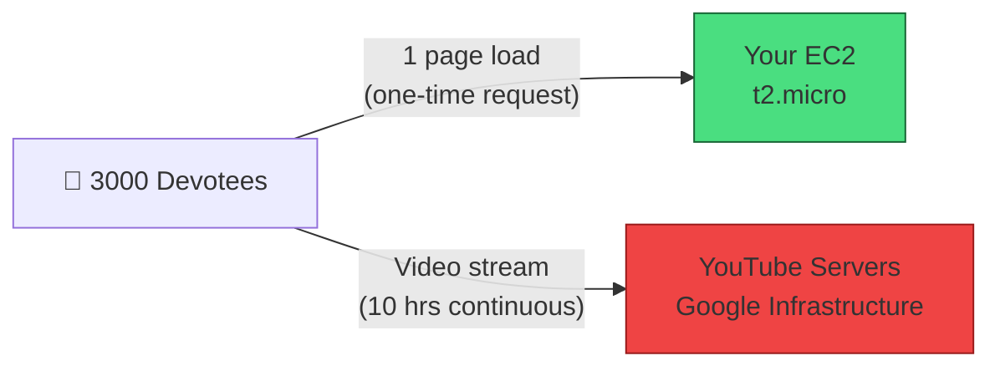

# 🚀 Hosting the Panchapeetas Django App on AWS — Complete Tutorial

> A step-by-step guide to deploying the **Veerashaiva Pancha Peethas** Django application on Amazon Web Services (AWS), migrating from PythonAnywhere/SQLite to a production-grade stack.

---

## Table of Contents

1. [Architecture Overview](#1-architecture-overview)
2. [Prerequisites](#2-prerequisites)
3. [Step 1 — Launch an EC2 Instance](#3-step-1--launch-an-ec2-instance)
4. [Step 2 — Initial Server Setup](#4-step-2--initial-server-setup)
5. [Step 3 — Set Up PostgreSQL on RDS](#5-step-3--set-up-postgresql-on-rds)
6. [Step 4 — Configure S3 for Media & Static Files](#6-step-4--configure-s3-for-media--static-files)
7. [Step 5 — Deploy the Django Application](#7-step-5--deploy-the-django-application)
8. [Step 6 — Configure Gunicorn (WSGI Server)](#8-step-6--configure-gunicorn-wsgi-server)
9. [Step 7 — Configure Nginx (Reverse Proxy)](#9-step-7--configure-nginx-reverse-proxy)
10. [Step 8 — SSL Certificate with Let's Encrypt](#10-step-8--ssl-certificate-with-lets-encrypt)
11. [Step 9 — Production Settings Changes](#11-step-9--production-settings-changes)
12. [Step 10 — Domain Name Setup (Route 53)](#12-step-10--domain-name-setup-route-53)
13. [Step 11 — Monitoring & Maintenance](#13-step-11--monitoring--maintenance)
14. [Free Tier Cost Breakdown](#14-free-tier-cost-breakdown)
15. [Traffic Capacity & Limits](#15-traffic-capacity--limits)
16. [Live Streaming — How It Actually Works](#16-live-streaming--how-it-actually-works)
17. [Temporary Upgrade for Events](#17-temporary-upgrade-for-events)
18. [Troubleshooting](#18-troubleshooting)

---

## 1. Architecture Overview



| Component | AWS Service | Free Tier? | Purpose |
|-----------|-------------|------------|---------|
| Web Server | EC2 (`t2.micro`) | ✅ 750 hrs/month free | Runs Nginx + Gunicorn + Django |
| Database | RDS PostgreSQL (`db.t3.micro`) | ✅ 750 hrs/month free | Replaces SQLite for production |
| Media Storage | S3 | ✅ 5 GB free | Stores peetha photos, swamiji images, profile pics |
| Static Files | S3 + CloudFront | ✅ 50 GB transfer free | CSS, JS, images served via CDN |
| DNS | Route 53 | ❌ ~$0.50/month | Custom domain management (optional — can use external registrar for $0) |
| SSL | Let's Encrypt | ✅ Always free | HTTPS encryption |

---

## 2. Prerequisites

Before starting, ensure you have:

- [ ] An **AWS Account** ([Sign up here](https://aws.amazon.com/free/))
- [ ] A **domain name** (e.g., `panchapeethas.org`) — can be purchased via Route 53 or any registrar
- [ ] **AWS CLI** installed on your local machine
- [ ] A **key pair** (`.pem` file) for SSH access
- [ ] **Git** installed locally

> [!TIP]
> AWS Free Tier gives you 750 hours/month of `t2.micro` EC2 + 750 hours/month of `db.t3.micro` RDS + 5 GB S3 for the **first 12 months**. This is more than enough for the Panchapeetas platform. Your total cost in Year 1 will be **~$0/month** (or $0.50 if using Route 53 for DNS).

---

## 3. Step 1 — Launch an EC2 Instance

### 3.1 Choose the Instance

1. Go to **AWS Console → EC2 → Launch Instance**
2. Configure:

| Setting | Value |
|---------|-------|
| **Name** | `panchapeethas-webserver` |
| **AMI** | Ubuntu Server 24.04 LTS (64-bit x86) |
| **Instance type** | `t2.micro` (1 vCPU, 1 GB RAM) — **Free Tier eligible** |
| **Key pair** | Create new or select existing `.pem` key |
| **Storage** | 30 GB gp3 (SSD) — Free Tier includes 30 GB |

### 3.2 Configure Security Group

Create a security group named `panchapeethas-sg` with these inbound rules:

| Type | Port | Source | Purpose |
|------|------|--------|---------|
| SSH | 22 | Your IP | Remote access |
| HTTP | 80 | 0.0.0.0/0 | Web traffic |
| HTTPS | 443 | 0.0.0.0/0 | Secure web traffic |

### 3.3 Allocate an Elastic IP

1. Go to **EC2 → Elastic IPs → Allocate**
2. Associate the Elastic IP with your instance

> [!IMPORTANT]
> Always use an Elastic IP for production. Without one, your server's public IP changes every time the instance restarts, breaking DNS records and SSL certificates.

```bash
# Note your Elastic IP, e.g.:
# 13.235.XX.XX
```

### 3.4 Connect to Your Instance

```bash
# Make the key read-only (on Windows, adjust via Properties > Security)
chmod 400 panchapeethas-key.pem

# SSH into the server
ssh -i panchapeethas-key.pem ubuntu@13.235.XX.XX
```

---

## 4. Step 2 — Initial Server Setup

Run these commands on the EC2 instance after SSH'ing in:

### 4.1 Update System Packages

```bash
sudo apt update && sudo apt upgrade -y
```

### 4.2 Install Required System Packages

```bash
sudo apt install -y \
    python3-pip \
    python3-venv \
    python3-dev \
    libpq-dev \
    postgresql-client \
    nginx \
    certbot \
    python3-certbot-nginx \
    git \
    supervisor \
    libjpeg-dev \
    zlib1g-dev \
    libfreetype6-dev
```

> [!NOTE]
> `libjpeg-dev`, `zlib1g-dev`, and `libfreetype6-dev` are required by the **Pillow** library that your project uses for image handling (swamiji photos, profile pics, peetha media).

### 4.3 Create a Dedicated System User

```bash
sudo adduser --system --group --home /opt/panchapeethas panchapeethas
```

### 4.4 Set Up the Firewall

```bash
sudo ufw allow OpenSSH
sudo ufw allow 'Nginx Full'
sudo ufw enable
sudo ufw status
```

---

## 5. Step 3 — Set Up PostgreSQL on RDS

> [!WARNING]
> SQLite (currently used in `config/settings.py`) is **not suitable for production**. It doesn't support concurrent writes, which will cause errors when multiple devotees book poojas simultaneously. Migrate to PostgreSQL.

### 5.1 Create an RDS Instance

1. Go to **AWS Console → RDS → Create database**
2. Configure:

| Setting | Value |
|---------|-------|
| **Engine** | PostgreSQL 16 |
| **Template** | Free Tier (or Production) |
| **DB Instance Identifier** | `panchapeethas-db` |
| **Master username** | `panchapeethas_admin` |
| **Master password** | *(generate a strong password and save it)* |
| **Instance class** | `db.t3.micro` (Free Tier) or `db.t3.small` |
| **Storage** | 20 GB gp3, enable auto-scaling |
| **VPC** | Same VPC as your EC2 |
| **Public access** | **No** |
| **Security group** | Create new: `panchapeethas-db-sg` |

### 5.2 Configure DB Security Group

Edit `panchapeethas-db-sg` inbound rules:

| Type | Port | Source | Purpose |
|------|------|--------|---------|
| PostgreSQL | 5432 | `panchapeethas-sg` (EC2 SG) | Allow EC2 → RDS |

### 5.3 Test the Connection from EC2

```bash
# From your EC2 instance:
psql -h panchapeethas-db.xxxxxx.ap-south-1.rds.amazonaws.com \
     -U panchapeethas_admin \
     -d postgres

# Inside psql, create the database:
CREATE DATABASE panchapeethas_db;
\q
```

---

## 6. Step 4 — Configure S3 for Media & Static Files

Your app stores images in `media/peetha_media/` and `media/profile_pics/`. On AWS, these should live in S3.

### 6.1 Create an S3 Bucket

1. Go to **AWS Console → S3 → Create Bucket**
2. Configure:

| Setting | Value |
|---------|-------|
| **Bucket name** | `panchapeethas-media` |
| **Region** | `ap-south-1` (Mumbai) |
| **Block public access** | Uncheck "Block all public access" for media |
| **Versioning** | Enabled (protects against accidental deletes) |

### 6.2 Create an IAM User for S3 Access

1. Go to **IAM → Users → Create User**
2. Name: `panchapeethas-s3-user`
3. Attach this custom policy:

```json
{
    "Version": "2012-10-17",
    "Statement": [
        {
            "Effect": "Allow",
            "Action": [
                "s3:PutObject",
                "s3:GetObject",
                "s3:DeleteObject",
                "s3:ListBucket"
            ],
            "Resource": [
                "arn:aws:s3:::panchapeethas-media",
                "arn:aws:s3:::panchapeethas-media/*"
            ]
        }
    ]
}
```

4. Generate **Access Key** and **Secret Key** — save them securely.

### 6.3 S3 Bucket Policy for Public Media Access

```json
{
    "Version": "2012-10-17",
    "Statement": [
        {
            "Sid": "PublicReadMedia",
            "Effect": "Allow",
            "Principal": "*",
            "Action": "s3:GetObject",
            "Resource": "arn:aws:s3:::panchapeethas-media/media/*"
        }
    ]
}
```

### 6.4 Install Django S3 Storage Backend

Add these to your `requirements.txt`:

```diff
 Django>=5.1.4,<5.2
 pillow>=12.0.0
 emoji>=2.15.0
 razorpay>=1.4.1
 whitenoise>=6.8.2
 django-allauth>=0.61.0
+gunicorn>=22.0.0
+psycopg2-binary>=2.9.9
+django-storages>=1.14.2
+boto3>=1.34.0
```

---

## 7. Step 5 — Deploy the Django Application

### 7.1 Clone the Repository

```bash
sudo -u panchapeethas -s
cd /opt/panchapeethas

# Clone your repo
git clone https://github.com/Gurucharan-G/panchapeeta.git app
cd app
```

### 7.2 Create a Virtual Environment

```bash
python3 -m venv venv
source venv/bin/activate

# Install dependencies
pip install --upgrade pip
pip install -r requirements.txt
```

### 7.3 Create the Environment File

Create `/opt/panchapeethas/app/.env`:

```bash
sudo nano /opt/panchapeethas/app/.env
```

Add the following content:

```ini
# ===== DJANGO CORE =====
DJANGO_SECRET_KEY=your-very-long-random-secret-key-here
PRODUCTION=True
DJANGO_ALLOWED_HOSTS=panchapeethas.org,www.panchapeethas.org,13.235.XX.XX

# ===== DATABASE (RDS PostgreSQL) =====
DB_ENGINE=django.db.backends.postgresql
DB_NAME=panchapeethas_db
DB_USER=panchapeethas_admin
DB_PASSWORD=your-rds-password-here
DB_HOST=panchapeethas-db.xxxxxx.ap-south-1.rds.amazonaws.com
DB_PORT=5432

# ===== AWS S3 =====
AWS_ACCESS_KEY_ID=AKIA...your-key
AWS_SECRET_ACCESS_KEY=your-secret-key
AWS_STORAGE_BUCKET_NAME=panchapeethas-media
AWS_S3_REGION_NAME=ap-south-1

# ===== GOOGLE OAUTH (django-allauth) =====
GOOGLE_CLIENT_ID=your-google-client-id
GOOGLE_CLIENT_SECRET=your-google-client-secret

# ===== RAZORPAY =====
# (Razorpay keys are managed per-Peetha via the PeethaPaymentConfig model)
```

> [!CAUTION]
> Never commit the `.env` file to Git. Add it to `.gitignore` immediately.

### 7.4 Generate a Secure Secret Key

```bash
python3 -c "from django.core.management.utils import get_random_secret_key; print(get_random_secret_key())"
```

Copy the output and paste it as the `DJANGO_SECRET_KEY` value in `.env`.

---

## 8. Step 6 — Configure Gunicorn (WSGI Server)

Gunicorn replaces Django's development server (`runserver`) for production.

### 8.1 Test Gunicorn

```bash
cd /opt/panchapeethas/app
source venv/bin/activate

gunicorn --bind 0.0.0.0:8000 config.wsgi:application
# Visit http://13.235.XX.XX:8000 to verify (then Ctrl+C)
```

### 8.2 Create a Systemd Service

```bash
sudo nano /etc/systemd/system/panchapeethas.service
```

Paste:

```ini
[Unit]
Description=Panchapeethas Django Application (Gunicorn)
After=network.target

[Service]
User=panchapeethas
Group=panchapeethas
WorkingDirectory=/opt/panchapeethas/app
EnvironmentFile=/opt/panchapeethas/app/.env
ExecStart=/opt/panchapeethas/app/venv/bin/gunicorn \
    --workers 2 \
    --bind unix:/opt/panchapeethas/app/panchapeethas.sock \
    --timeout 120 \
    --access-logfile /var/log/panchapeethas/access.log \
    --error-logfile /var/log/panchapeethas/error.log \
    config.wsgi:application
Restart=always
RestartSec=3

[Install]
WantedBy=multi-user.target
```

### 8.3 Create Log Directory & Enable Service

```bash
sudo mkdir -p /var/log/panchapeethas
sudo chown panchapeethas:panchapeethas /var/log/panchapeethas

sudo systemctl daemon-reload
sudo systemctl start panchapeethas
sudo systemctl enable panchapeethas

# Verify it's running
sudo systemctl status panchapeethas
```

> [!TIP]
> **Why 2 workers?** The `t2.micro` has 1 vCPU and 1 GB RAM. The formula is `(2 × CPU cores) + 1 = 3`, but we use 2 to stay within the 1 GB RAM limit. Each Gunicorn worker uses ~100-150 MB. If you upgrade to `t3.small` (2 vCPU, 2 GB RAM) for an event, increase this to 3–4 workers.

---

## 9. Step 7 — Configure Nginx (Reverse Proxy)

Nginx sits in front of Gunicorn, handling SSL termination, static files, and request buffering.

### 9.1 Create the Nginx Site Config

```bash
sudo nano /etc/nginx/sites-available/panchapeethas
```

Paste:

```nginx
server {
    listen 80;
    server_name panchapeethas.org www.panchapeethas.org 13.235.XX.XX;

    # Redirect all HTTP to HTTPS (enabled after SSL setup)
    # return 301 https://$host$request_uri;

    # Max upload size (for swamiji photos, media uploads)
    client_max_body_size 20M;

    # Static files (served by WhiteNoise, but Nginx can cache)
    location /static/ {
        alias /opt/panchapeethas/app/staticfiles/;
        expires 30d;
        add_header Cache-Control "public, immutable";
    }

    # Media files (if not using S3 yet)
    location /media/ {
        alias /opt/panchapeethas/app/media/;
        expires 7d;
    }

    # Proxy to Gunicorn
    location / {
        proxy_pass http://unix:/opt/panchapeethas/app/panchapeethas.sock;
        proxy_set_header Host $host;
        proxy_set_header X-Real-IP $remote_addr;
        proxy_set_header X-Forwarded-For $proxy_add_x_forwarded_for;
        proxy_set_header X-Forwarded-Proto $scheme;
    }
}
```

### 9.2 Enable the Site

```bash
sudo ln -s /etc/nginx/sites-available/panchapeethas /etc/nginx/sites-enabled/
sudo rm /etc/nginx/sites-enabled/default

# Test configuration
sudo nginx -t

# Restart Nginx
sudo systemctl restart nginx
```

---

## 10. Step 8 — SSL Certificate with Let's Encrypt

### 10.1 Obtain the Certificate

```bash
sudo certbot --nginx -d panchapeethas.org -d www.panchapeethas.org
```

Follow the prompts (enter email, agree to terms). Certbot will:
- Obtain the SSL certificate
- Auto-modify your Nginx config to redirect HTTP → HTTPS

### 10.2 Verify Auto-Renewal

```bash
sudo certbot renew --dry-run
```

> [!NOTE]
> Certbot automatically sets up a cron job/systemd timer to renew certificates before they expire (every 90 days).

---

## 11. Step 9 — Production Settings Changes

Create a new file `config/settings_production.py` or update `config/settings.py` to read from environment variables:

### 11.1 Update `config/settings.py`

The key changes needed in your existing [settings.py](file:///c:/Users/Bhoja/.gemini/antigravity-ide/scratch/panchapeetas/config/settings.py):

```python
import os
from pathlib import Path

BASE_DIR = Path(__file__).resolve().parent.parent

# ===== SECURITY =====
SECRET_KEY = os.environ.get('DJANGO_SECRET_KEY')
DEBUG = not os.environ.get('PRODUCTION', 'False') == 'True'  # Already done ✅

ALLOWED_HOSTS = os.environ.get(
    'DJANGO_ALLOWED_HOSTS',
    'localhost,127.0.0.1'
).split(',')

# ===== DATABASE =====
# Replace the SQLite block with:
if os.environ.get('DB_ENGINE'):
    DATABASES = {
        'default': {
            'ENGINE': os.environ.get('DB_ENGINE', 'django.db.backends.sqlite3'),
            'NAME': os.environ.get('DB_NAME', BASE_DIR / 'db.sqlite3'),
            'USER': os.environ.get('DB_USER', ''),
            'PASSWORD': os.environ.get('DB_PASSWORD', ''),
            'HOST': os.environ.get('DB_HOST', 'localhost'),
            'PORT': os.environ.get('DB_PORT', '5432'),
        }
    }
else:
    DATABASES = {
        'default': {
            'ENGINE': 'django.db.backends.sqlite3',
            'NAME': BASE_DIR / 'db.sqlite3',
        }
    }

# ===== AWS S3 STORAGE (production only) =====
if not DEBUG:
    # Static files via WhiteNoise (already configured ✅)
    STATICFILES_STORAGE = "whitenoise.storage.CompressedManifestStaticFilesStorage"

    # Media files via S3
    DEFAULT_FILE_STORAGE = 'storages.backends.s3boto3.S3Boto3Storage'
    AWS_ACCESS_KEY_ID = os.environ.get('AWS_ACCESS_KEY_ID')
    AWS_SECRET_ACCESS_KEY = os.environ.get('AWS_SECRET_ACCESS_KEY')
    AWS_STORAGE_BUCKET_NAME = os.environ.get('AWS_STORAGE_BUCKET_NAME')
    AWS_S3_REGION_NAME = os.environ.get('AWS_S3_REGION_NAME', 'ap-south-1')
    AWS_S3_CUSTOM_DOMAIN = f'{AWS_STORAGE_BUCKET_NAME}.s3.amazonaws.com'
    AWS_DEFAULT_ACL = None
    AWS_S3_OBJECT_PARAMETERS = {
        'CacheControl': 'max-age=86400',
    }
    MEDIA_URL = f'https://{AWS_S3_CUSTOM_DOMAIN}/media/'

# ===== SECURITY HEADERS (production) =====
if not DEBUG:
    SECURE_SSL_REDIRECT = True                   # Already done ✅
    SESSION_COOKIE_SECURE = True                 # Already done ✅
    CSRF_COOKIE_SECURE = True                    # Already done ✅
    SECURE_HSTS_SECONDS = 31536000               # Already done ✅
    SECURE_HSTS_INCLUDE_SUBDOMAINS = True         # Already done ✅
    SECURE_HSTS_PRELOAD = True                   # Already done ✅
    SECURE_PROXY_SSL_HEADER = ('HTTP_X_FORWARDED_PROTO', 'https')  # NEW
    CSRF_TRUSTED_ORIGINS = [
        'https://panchapeethas.org',
        'https://www.panchapeethas.org',
    ]  # NEW
```

### 11.2 Run Migrations & Collect Static

```bash
cd /opt/panchapeethas/app
source venv/bin/activate

# Load environment variables
export $(grep -v '^#' .env | xargs)

# Run migrations on the new PostgreSQL database
python manage.py migrate

# Collect static files
python manage.py collectstatic --noinput

# Create a superuser for the admin panel
python manage.py createsuperuser
```

### 11.3 Migrate Existing Data from SQLite

If you have existing data in `db.sqlite3` that you want to move to PostgreSQL:

```bash
# Step 1: Export data from SQLite (on your local machine)
python manage.py dumpdata --exclude contenttypes --exclude auth.permission \
    --indent 2 > datadump.json

# Step 2: Copy to EC2
scp -i panchapeethas-key.pem datadump.json ubuntu@13.235.XX.XX:/opt/panchapeethas/app/

# Step 3: Load into PostgreSQL (on EC2)
python manage.py loaddata datadump.json
```

> [!WARNING]
> Run `python manage.py migrate` on the RDS database **before** loading the data dump. The tables must exist first.

---

## 12. Step 10 — Domain Name Setup (Route 53)

### 12.1 If Domain is on Route 53

1. Go to **Route 53 → Hosted Zones → your domain**
2. Create records:

| Record Type | Name | Value |
|-------------|------|-------|
| A | `panchapeethas.org` | `13.235.XX.XX` (your Elastic IP) |
| A | `www.panchapeethas.org` | `13.235.XX.XX` |

### 12.2 If Domain is with Another Registrar (GoDaddy, Namecheap, etc.)

1. Add an **A record** pointing to your Elastic IP
2. Or, point nameservers to Route 53's NS records

---

## 13. Step 11 — Monitoring & Maintenance

### 13.1 Deployment Checklist

Run this after every deployment:

```bash
#!/bin/bash
# deploy.sh — save this in /opt/panchapeethas/app/

cd /opt/panchapeethas/app
source venv/bin/activate
export $(grep -v '^#' .env | xargs)

git pull origin main
pip install -r requirements.txt
python manage.py migrate --noinput
python manage.py collectstatic --noinput

sudo systemctl restart panchapeethas
sudo systemctl restart nginx

echo "✅ Deployment complete!"
```

Make it executable:

```bash
chmod +x /opt/panchapeethas/app/deploy.sh
```

### 13.2 View Logs

```bash
# Gunicorn application logs
sudo tail -f /var/log/panchapeethas/error.log

# Nginx access logs
sudo tail -f /var/log/nginx/access.log

# Django errors (if you add file logging)
sudo tail -f /var/log/panchapeethas/access.log
```

### 13.3 Set Up CloudWatch Monitoring (Optional)

1. Go to **EC2 → Instance → Monitoring tab → Manage detailed monitoring**
2. Enable detailed monitoring (1-minute intervals)
3. Set up **CloudWatch Alarms** for:
   - CPU utilization > 80%
   - Disk space > 85%
   - Status check failures

### 13.4 Automatic Database Backups

RDS handles automated backups:

1. Go to **RDS → Your DB → Modify**
2. Set **Backup retention period** to 7 days
3. Enable **Multi-AZ deployment** for high availability (production)

---

## 14. Free Tier Cost Breakdown

### Year 1 (Free Tier Active)

| Service | Instance | Free Tier Allowance | Monthly Cost |
|---------|----------|--------------------|--------------|
| EC2 | `t2.micro` (1 vCPU, 1 GB) | 750 hrs/month | **$0** |
| RDS PostgreSQL | `db.t3.micro` | 750 hrs/month | **$0** |
| S3 | 5 GB storage | 5 GB + 20K GETs | **$0** |
| EBS Storage | 30 GB gp3 | 30 GB free | **$0** |
| Elastic IP | Associated with running instance | Free when attached | **$0** |
| Data Transfer | Outbound | 100 GB/month | **$0** |
| SSL (Let's Encrypt) | Certificate | Always free | **$0** |
| Route 53 (optional) | Hosted zone | Not included in Free Tier | ~$0.50 |
| **Total (Year 1)** | | | **$0/month** |
| | | *(or $0.50 with Route 53)* | |

> [!TIP]
> **Skip Route 53 entirely** to make it truly $0/month. Just point your domain's A record to the Elastic IP from your existing domain registrar (GoDaddy, Namecheap, etc.).

### After Year 1 (Free Tier Expired)

| Service | Instance | Monthly Cost (ap-south-1) |
|---------|----------|---------------------------|
| EC2 | `t2.micro` | ~$8.50/month |
| RDS PostgreSQL | `db.t3.micro` | ~$13/month |
| S3 | 5 GB storage + transfers | ~$1/month |
| Elastic IP | Associated with running instance | $0 |
| **Total (After Year 1)** | | **~$22.50/month** |

> [!TIP]
> **Save money after Free Tier**: Use **EC2 Reserved Instances** (1-year commitment) for ~40% savings on EC2, bringing total to ~$15/month.

---

## 15. Traffic Capacity & Limits

### `t2.micro` Specifications

| Resource | Value |
|----------|-------|
| vCPU | 1 |
| RAM | 1 GB |
| Baseline CPU | 10% |
| Burst CPU | 100% (using credits) |
| CPU credits earned/hour | 6 |
| Max stored credits | 144 |

### How Much Traffic Can It Handle?

| Metric | `t2.micro` Capacity |
|--------|---------------------|
| **Concurrent users** | ~20–50 at the same time |
| **Requests per second** | ~10–30 req/s |
| **Daily unique visitors** | ~2,000–5,000 |
| **Monthly visitors** | ~50,000–100,000 |
| **Daily page views** | ~10,000–25,000 |
| **Pooja bookings per day** | ~500 |

### Performance by Feature

| Action | Response Time | Daily Capacity |
|--------|---------------|----------------|
| Homepage load | ~200–400ms | Thousands |
| Peetha detail page | ~300–500ms | Thousands |
| Pooja booking + Razorpay | ~500–800ms | ~500 bookings |
| Media gallery (images from S3) | Fast ✅ | Unlimited (S3 offloads this) |
| Google OAuth login | ~300ms | Hundreds |
| Admin dashboard | ~400ms | No issue |

### Understanding CPU Credits (Burstable Performance)

The `t2.micro` uses a **CPU credit system** — think of it like a prepaid mobile plan:

| Traffic Pattern | What Happens | Duration at Full Speed |
|----------------|-------------|------------------------|
| **Normal** (< 10% CPU avg) | Credits accumulate ✅ | Indefinitely |
| **Spike** (500 users at once) | Burns stored credits ⚡ | ~1–2 hours |
| **Moderate spike** (100 users) | Gradual credit use | ~4–6 hours |
| **Sustained high load** (hours of > 20% CPU) | Credits deplete → throttled to 10% 🐢 | Site becomes slow |

### When to Upgrade

| Signal | Action |
|--------|--------|
| CPU credits consistently at 0 | Upgrade to `t3.small` (~$15/month) |
| Response times > 2 seconds | Increase Gunicorn workers (needs more RAM) |
| > 200 concurrent users during festivals | Temporarily upgrade (see Section 17) |
| > 500 daily pooja bookings | Consider RDS `db.t3.small` |

> [!NOTE]
> For a temple/spiritual platform like Panchapeetas, typical early traffic is **100–500 visitors/day** — well within `t2.micro` capacity. You'll only hit limits during viral moments or major festivals.

---

## 16. Live Streaming — How It Actually Works

Your app uses **embedded YouTube live streams** (via the `live_youtube_url` field on each Peetha). This is critical to understand for capacity planning:

### Architecture: YouTube Does the Heavy Lifting



| Action | Hits Your EC2? | Load on Your Server |
|--------|---------------|---------------------|
| Opening the peetha page | ✅ Yes | **1 request per user** |
| Watching YouTube live stream for hours | ❌ No | **Zero** — YouTube handles it |
| Refreshing the page | ✅ Yes | 1 request |
| Booking a pooja while watching | ✅ Yes | 2–3 requests |
| YouTube chat/comments | ❌ No | YouTube handles it |

### Real Scenario: 3000 Users × 10 Hours × 10 Days

| Metric | Value |
|--------|-------|
| **Peak EC2 load** | ~3000 page loads when users first open the page |
| **Sustained EC2 load while watching** | **Nearly zero** |
| **YouTube cost to you** | **$0** — YouTube hosts everything for free |
| **EC2 data transfer** | ~3000 × 500 KB = **~1.5 GB** one-time |
| **S3 data transfer** | Images on the page = ~3 GB total |
| **Your total cost** | **$0** (Free Tier) |

### Can `t2.micro` Handle the Initial Rush?

| If 3000 users arrive... | Result |
|--------------------------|--------|
| Over 2–3 hours (gradual) | ✅ **Fine** — ~15 req/sec is manageable |
| Within 30 minutes | ⚠️ **Sluggish page loads** but functional |
| All within 5 minutes (simultaneous) | ❌ **Will struggle** — temporarily upgrade to `t3.small` |

> [!TIP]
> If you announce a live stream time in advance (e.g., "Swamiji's live darshan at 6 PM"), expect most users to arrive within a 15-minute window. In this case, temporarily upgrade to `t3.small` for that day (see next section). After the page loads, your server is essentially idle while 3000 users watch YouTube.

---

## 17. Temporary Upgrade for Events

For high-traffic events (festivals, special live streams), you can upgrade your EC2 instance temporarily and downgrade after. It takes ~2 minutes and costs very little.

### How to Upgrade (3 Steps)

```
Step 1: Stop the instance
   AWS Console → EC2 → Select instance → Instance State → Stop

Step 2: Change instance type
   Actions → Instance Settings → Change Instance Type → t3.small → Apply

Step 3: Start the instance
   Instance State → Start
```

### How to Downgrade After the Event

Same 3 steps — just change `t3.small` back to `t2.micro`.

> [!NOTE]
> Your **Elastic IP stays attached** through stop/start, so your domain URL doesn't change. All data, configuration, and deployments remain intact. Nothing needs to be re-configured.

### Downtime During Upgrade

| Step | Duration |
|------|----------|
| Stop instance | ~30 seconds |
| Change type | Instant |
| Start instance | ~60 seconds |
| **Total downtime** | **~2 minutes** |

### Cost for Temporary Upgrades

| Instance | Cost/Hour | 1 Day | 3 Days | 10 Days |
|----------|-----------|-------|--------|---------|
| `t2.micro` (Free Tier) | $0 | $0 | $0 | $0 |
| `t3.small` (2 vCPU, 2 GB) | $0.023 | **$0.55** | **$1.66** | **$5.52** |
| `t3.medium` (2 vCPU, 4 GB) | $0.046 | **$1.10** | **$3.31** | **$11.04** |

### Don't Forget: Update Gunicorn Workers After Upgrade

When you upgrade to `t3.small` (2 GB RAM), increase Gunicorn workers for better performance:

```bash
# SSH into EC2 after the instance restarts
ssh -i panchapeethas-key.pem ubuntu@13.235.XX.XX

# Edit the service file
sudo nano /etc/systemd/system/panchapeethas.service
# Change: --workers 2  →  --workers 4

# Reload and restart
sudo systemctl daemon-reload
sudo systemctl restart panchapeethas
```

When you downgrade back to `t2.micro`, change workers back to 2.

### Example: Shivaratri Live Event Plan

```
📅 Day before Shivaratri:
   └─ Stop → Change to t3.small → Start         (~₹45/day)
   └─ SSH in → Update Gunicorn workers to 4
   └─ Test the site is working

🕉️ Shivaratri Day:
   └─ 3000 devotees watch live darshan            ✅ No issues
   └─ Pooja bookings come in throughout the day   ✅ Handled
   └─ YouTube serves all video traffic             ✅ $0 cost

📅 Day after Shivaratri:
   └─ Stop → Change back to t2.micro → Start      ($0/day)
   └─ SSH in → Update Gunicorn workers back to 2
   └─ Total event cost: ~₹45 ($0.55)
```

---

## 18. Troubleshooting

### Common Issues

| Problem | Cause | Solution |
|---------|-------|----------|
| **502 Bad Gateway** | Gunicorn not running or socket mismatch | `sudo systemctl status panchapeethas` → check logs |
| **Static files missing** | `collectstatic` not run | `python manage.py collectstatic --noinput` |
| **Media uploads fail** | S3 permissions or bucket policy | Check IAM policy and bucket CORS settings |
| **Database connection refused** | Security group misconfigured | Ensure EC2 SG is allowed in RDS SG on port 5432 |
| **CSRF verification failed** | Missing `CSRF_TRUSTED_ORIGINS` | Add your domain to `CSRF_TRUSTED_ORIGINS` in settings |
| **Google OAuth redirect error** | Wrong callback URL in Google Console | Update to `https://panchapeethas.org/accounts/google/login/callback/` |
| **Razorpay webhook failures** | Server not reachable on HTTPS | Verify SSL is working and port 443 is open |

### Useful Debug Commands

```bash
# Check if Gunicorn is running
sudo systemctl status panchapeethas

# Check Nginx config syntax
sudo nginx -t

# Check open ports
sudo ss -tlnp

# Test database connection
python manage.py dbshell

# Run Django checks
python manage.py check --deploy
```

---

## Quick Reference — Complete Command Summary

```bash
# ===== FIRST-TIME SETUP =====
# 1. SSH into EC2
ssh -i panchapeethas-key.pem ubuntu@13.235.XX.XX

# 2. Install packages
sudo apt update && sudo apt upgrade -y
sudo apt install -y python3-pip python3-venv python3-dev libpq-dev \
    postgresql-client nginx certbot python3-certbot-nginx git \
    libjpeg-dev zlib1g-dev libfreetype6-dev

# 3. Clone & set up
sudo adduser --system --group --home /opt/panchapeethas panchapeethas
sudo -u panchapeethas git clone <repo-url> /opt/panchapeethas/app
cd /opt/panchapeethas/app
sudo -u panchapeethas python3 -m venv venv
sudo -u panchapeethas venv/bin/pip install -r requirements.txt

# 4. Configure .env, systemd service, nginx (as shown above)

# 5. Deploy
python manage.py migrate
python manage.py collectstatic --noinput
python manage.py createsuperuser
sudo systemctl start panchapeethas
sudo systemctl start nginx

# 6. SSL
sudo certbot --nginx -d panchapeethas.org -d www.panchapeethas.org

# ===== SUBSEQUENT DEPLOYMENTS =====
/opt/panchapeethas/app/deploy.sh
```

---

> [!IMPORTANT]
> **After deployment**, remember to:
> 1. Update your **Google OAuth** redirect URIs in the Google Cloud Console to use your new AWS domain
> 2. Re-configure the **Django Sites** framework (`SITE_ID = 1`) via the admin panel to match your new domain
> 3. Update **Razorpay webhook URLs** in the Razorpay Dashboard to point to your new domain
> 4. Load your existing Peetha data using `loaddata` or re-enter it via the admin dashboard
